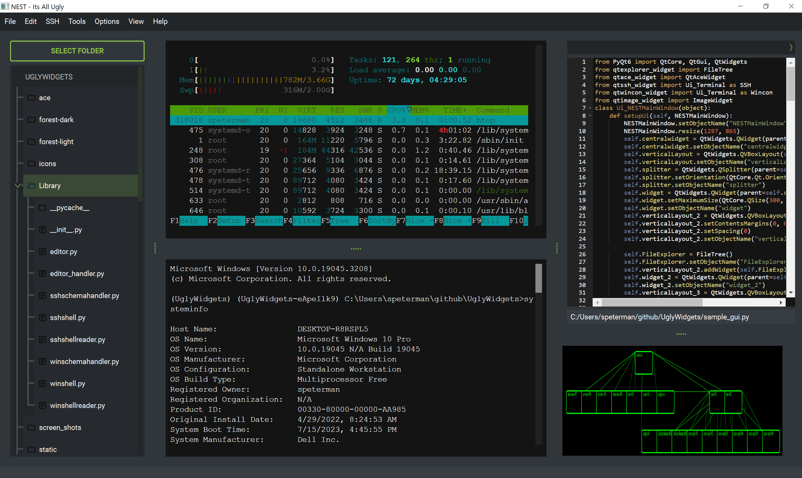

# PyQt6 UglyWidgets - SSH, Windows Terminal, Ace Editor and other re-usable widgets
### Because not everything should be a Web application ;)

This README provides a project-level overview, including a summary of the purpose, widget functionality and a sample application with brief descriptions of its components.
Project Location: [Link to UglyWidgets](https://github.com/scottpeterman/UglyWidgets)

## Project Overview

UglyWidgets is a collection of usefull PyQt6 re-usable widgets for building automation GUI interfaces. The POC application provides a graphical interface for full embedded ssh client with xterm.js support, a fully functional embedded windows terminal - supports cmd.exe, powershell.exe or wsl.exe, FileTree browsing files and editing code, built using the PyQt6 framework. The sample application is modular (and very rough), with the components implemented as separate widgets that can be reused in other PyQt6 applications. This is a work in progress and not appropriate for production envornments. Testing was all done on Windows 10 with Python 3.9.13

### Sample Application: sample_gui.py and sample_gui_with_prompt.py

### Widgets in stand-alone mode:

## Project Components

The project is composed of several PyQt6 Widgets, each providing specific functionality. Here's a list of the main components:

- `sample_gui.py`: This is an example application main windows that brings together the SSH Widget, Windows Terminal, file explorer and code editor widgets to form the complete application. It initially presents the file explorer and opens files in the code editor widget when they're double-clicked in the file explorer.

- `qtssh_widget.py`: The PyQt6 SSH Terminal Widget provides an SSH terminal interface within a PyQt6 application. It allows users to connect to a remote machine using SSH credentials (IP address, username, and password). Once connected, users can execute commands on the remote machine directly from this widget.

- `qtwincon_widget.py`: The PyQt6 Windows Terminal Widget provides a terminal interface within a PyQt6 application that can interact with different shells such as cmd, PowerShell, or Windows Subsystem for Linux (WSL2). Users can execute shell commands directly from this widget.

- `qtace_widget.py`: This script defines the `QtAceWidget` class, a widget that provides a code editor interface. The code editor is an implementation of the Ace code editor and allows for viewing and editing files directly within the application.

- `qtexplorer.py`: This script defines the `FileTree` class, a widget that provides a tree-based file explorer interface. The file explorer allows users to navigate their file system in a tree structure, with folders and files represented as tree items.

## Use of Xterm.js and PyQt6 Webengine
## xterm.js Overview

xterm.js is an open-source library that provides an interactive terminal within your web browser. It's designed to be easy to use and customizable, making it a powerful tool for developers who want to integrate a terminal into their web-based applications.

## Key Features

- **Terminal Emulation**: xterm.js provides a full suite of terminal emulation features. It supports standard input/output and can emulate most of the functionality found in a regular Unix terminal, including handling typical control characters and interpreting escape sequences.

- **Customizability**: You can modify many aspects of xterm.js to fit your needs, such as the appearance of the terminal (including fonts and colors), cursor style, and whether certain keyboard events are captured or ignored.

- **Add-Ons**: xterm.js supports add-ons, which are separate scripts that extend the functionality of the terminal. Examples include a search add-on, which provides a way to search the terminal buffer, and a web links add-on, which enables web links within the terminal.

- **Unicode Support**: xterm.js has extensive Unicode support, allowing it to display a wide range of characters and symbols.

## QWebEngineView

QWebEngineView is a widget provided by PyQt that is used to embed web content in applications. It is based on the Chrome browser and thus supports modern web technologies such as HTML5, CSS3, JavaScript, and so on. In the context of our project, it allows the display and interaction with the xterm.js terminal within the PyQt6 application.

## QWebChannel

While QWebEngineView allows the PyQt application to display web content, QWebChannel is the key component for enabling interaction between Python and JavaScript.

QWebChannel establishes a communication channel between the QWebEngineView instance and JavaScript running in it. It allows Python-side objects to be published and their methods and properties to be invoked/called from JavaScript. Similarly, JavaScript objects can be published and invoked from the Python side.

This two-way communication is crucial in our project as it allows xterm.js, running in the web view, to interact with the rest of the PyQt application. For instance, when a user types a command into the xterm.js terminal, QWebChannel can communicate this input back to the Python application for processing. The Python application can then send the output of that command back to the xterm.js terminal via QWebChannel.

By using these components together, PyQt6 provides a robust way of integrating complex web content and allowing intricate interactions between the PyQt6 application and the embedded web view.

### How its used in qtssh_widget.py

## Winpty

Winpty is a Windows software package providing an interface similar to a Unix pty-master for communicating with Windows console programs. The package includes a Cygwin-compatible library and utility programs. In the context of this project, winpty provides a way to handle the terminal's input and output on Windows.

## Paramiko

Paramiko is a Python library that implements the SSHv2 protocol for secure (encrypted and authenticated) connections to remote machines. It provides functionalities to create new sessions, execute commands, and transfer files over SSH. In this project, Paramiko is used to establish and manage SSH connections from the Python application to a remote server.

## Additional Resources

For more detailed information about each of these components, refer to their respective README files:

- [README_qtssh.md](./readme_qtssh_widget.md)
- [README_qtwincon_widget.md](./readme_qtwincon_widget.md)
- [README_qtace_widget.md](./readme_qtace_widget.md)
- [README_qtexplorer.md](./readme_qtexplorer.md)

<meta name="google-site-verification" content="6qF6kKBZ6q4VItmtN-B12aiyN4HP5tyAsYpP7VXyHi4" />
